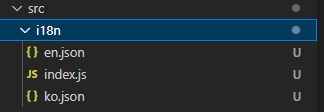

# react-i18next-tutorial

### 설치

아래의 패키지를 설치한다

* react-i18next
* i18next

```
npm i i18next react-i18next
```

### 설정

src 폴더안에 i18n 폴더를 생성한다.  



그리고 i18n의 설정파일을 작성한다

```js
//index.js
import i18n from 'i18next';
import { initReactI18next } from 'react-i18next';
import en from './en.json'
import ko from './ko.json'


i18n
    .use(initReactI18next)
    .init({
        debug: true,    //디버깅 모드를 활성화 한다, 브라우저에서 console에 로그가 뜬다
        resources: {
            en: {
                translation: en
            },
            ko: {
                translation: ko
            }
        },
        fallbackLng: 'en'
    })
```

i18n 의 use() 메소드로 여러가지 플러그인을 적용할수있다.  
기본적으로 [사용자의 브라우저 언어를 감지하는 플러그인](https://github.com/i18next/i18next-browser-languageDetector)을 자주 사용하는것 같지만 이 예제에서는 
다른 플러그인은 사용하지 않았다.  
  
init() 메소드에서 옵션 지정이 가능하다.  
[여기](https://www.i18next.com/overview/configuration-options) 에 지정 가능한 옵션 목록이 나와있다.  
가장 기본적인 옵션 내용은 아래와 같다.  
  

| 옵션  | 기본값 | 설명 |
| ------------- | ------------- | -------------|
| resources  | undefined  | 언어번역에 사용할 리소스(언어 목록) |
| lng  | undefined  | 기본 언어값 |
|fallbackLng|'dev'|사용자의 언어로된 번역을 사용할수 없을경우에 사용할 언어|
  
  
  
  
```js
resources:{
    en:{
        translation:en      //import 한 영문 json 파일
    },
    ko:{
        translation:ko      //import 한 한글 json 파일
    }
}
```
  
리소스 옵션에 이렇게 사용할 언어들을 선언한다.  
이때 json 파일의 key값은 전부 동일해야한다.  

```js
// ko.json
{
    "title":"타이틀",
    "body":"글 내용"
}

// en.json
{
    "title":"title",
    "body":"post body"
}
```

### 리액트에 적용하기

먼저 /i18n/index.js 파일을 리액트의 메인 index.js 파일에 임포트 시킨다.  

```js
import React from 'react';
import ReactDOM from 'react-dom/client';
import App from './App';
import './i18n'     // i18n index.js 

const root = ReactDOM.createRoot(document.getElementById('root'));
root.render(
  <React.StrictMode>
    <App />
  </React.StrictMode>
);
```

그리고 사용해야할 컴포넌트에서 useTranslation() 훅을 사용하여 번역할 언어를 표시한다.  
  

```js
import React from 'react';
import { useTranslation } from 'react-i18next';

export function MyComponent() {
  const { t, i18n } = useTranslation();
  // or const [t, i18n] = useTranslation();

  return <p>{t('여기에 키값을 넣는다')}</p>
}
```

  
  
  
### 언어 변환하기

useTranslation() 훅의 i18n.changeLanguage() 를 사용하여 언어를 변경할수있다.  
가장 기본적인 쿼리 스트링으로 언어를 변경하는 예제.  
  
  
```js
import { useEffect } from "react";
import { useTranslation } from "react-i18next";
import { useSearchParams } from "react-router-dom";

function App() {
  const [qs]=useSearchParams()
  const {t,i18n}=useTranslation()

  useEffect(()=>{
    i18n.changeLanguage(qs.get('lang'))
  },[])

  return (
    <div>
      <div>
        {t('title')}
      </div>
      <div>
        {t('body')}
      </div>
    </div>
  );
}

export default App;
```
  
  
